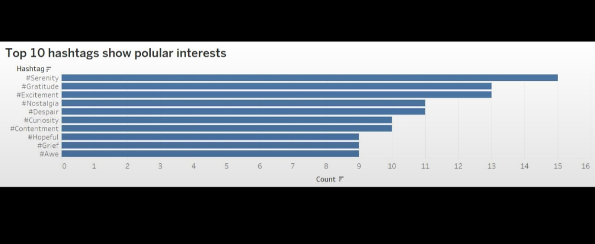
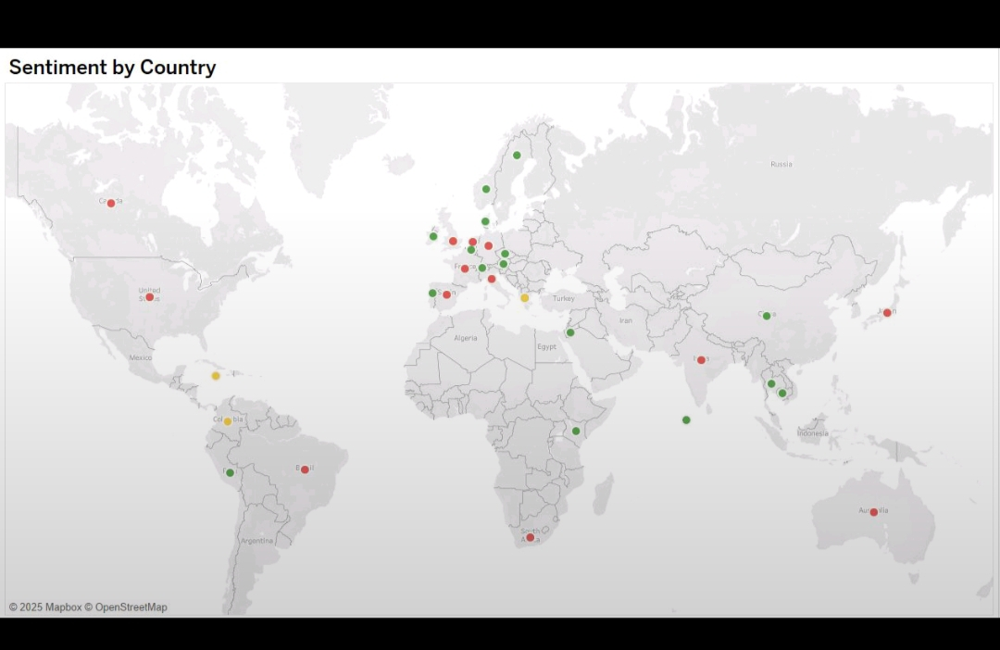
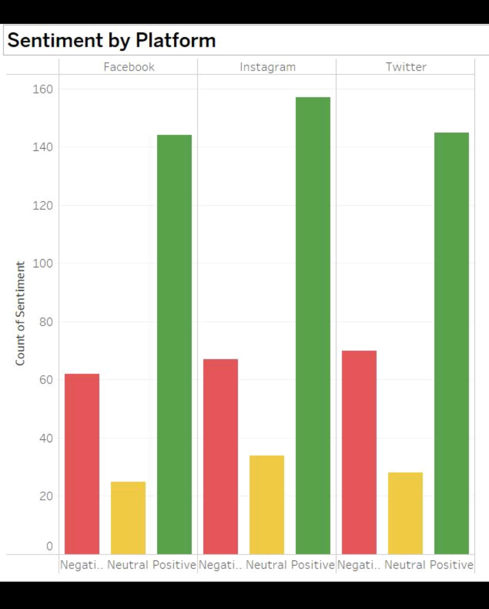
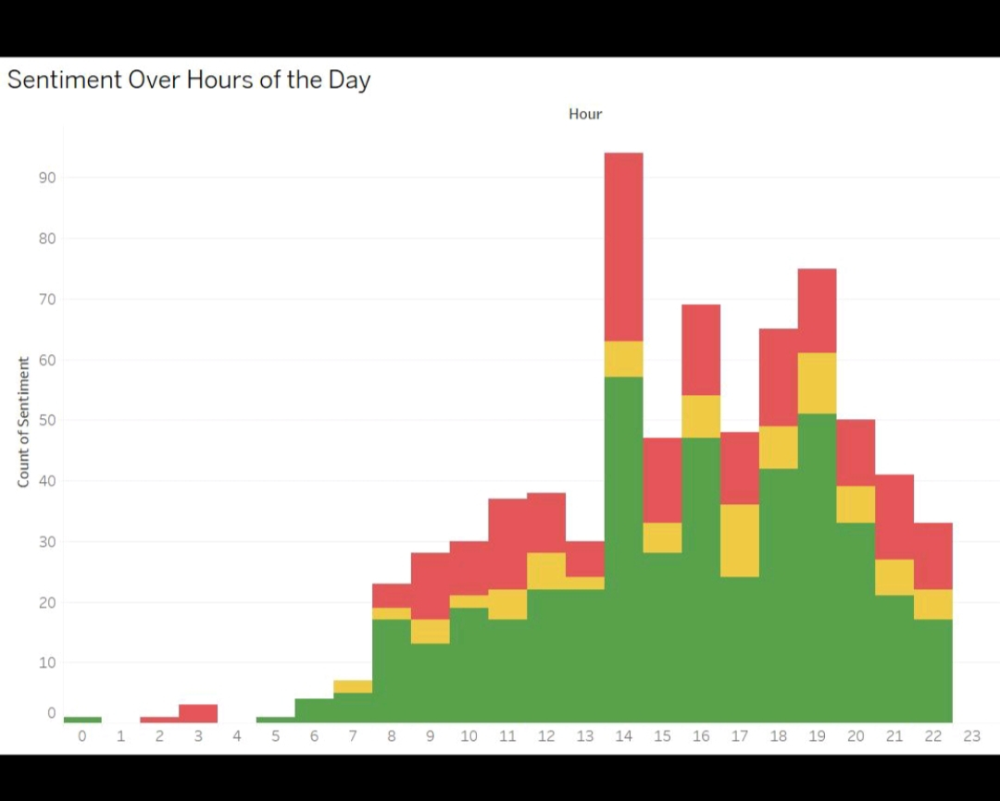
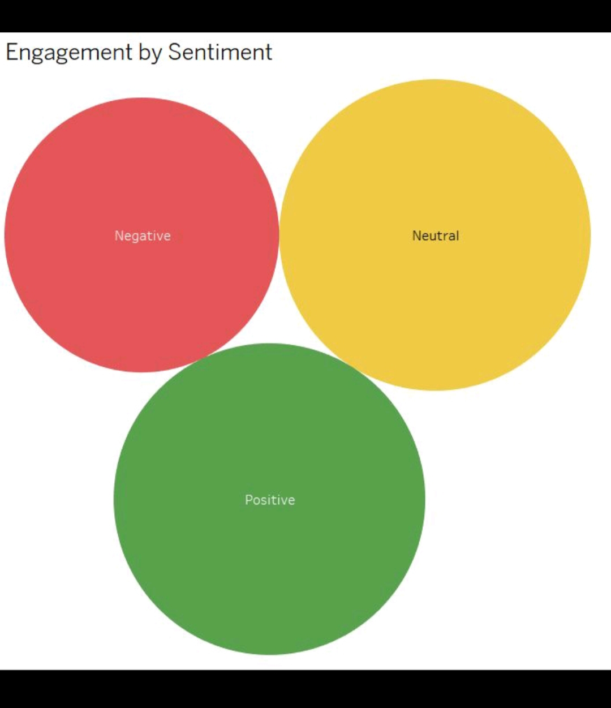
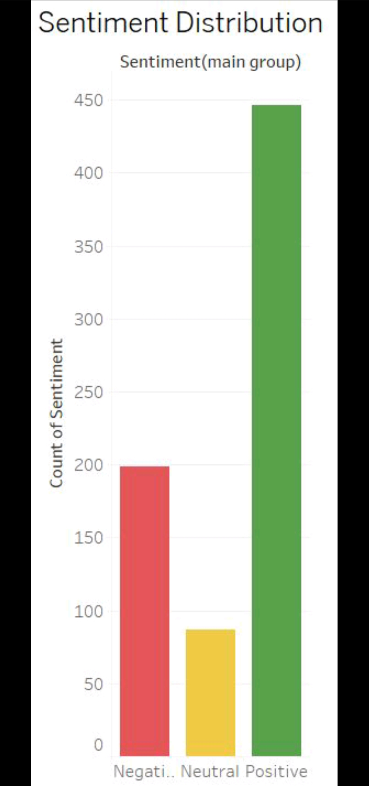

# 📊 Social Media Sentiment Analysis Dashboard

## 🔍 Project Overview

This project focuses on analyzing trending topics and sentiments across major social media platforms (Twitter, Instagram, and Facebook). The goal is to uncover user interests, market shifts, and engagement patterns to inform business decision-making.

It leverages:

* Natural Language Processing (NLP)
* Sentiment Analysis
* Visual Dashboards to present insights

## 🎯 Objectives

* Identify top-performing hashtags.
* Understand user sentiment patterns by time, platform, and country.
* Discover when users are most active and engaged.
* Uncover engagement behavior (likes/retweets) tied to sentiment.

## 🧠 Skills Applied

* **Python:** Preprocessing, NLP, Sentiment Analysis
* **Tableau:** Interactive Visualizations & Dashboards
* Data Cleaning and Structuring
* Business Metrics Interpretation

## 📁 Dataset

A dataset containing 732 social media posts with fields like:
`Text`, `Sentiment`, `Timestamp`, `Platform`, `Hashtags`, `Retweets`, `Likes`, `Country`, etc.

## Data Analysis Visualizations

Here are some visualizations of the data:

# Sentiment Analysis Project

📈 **Dashboards**

Here are the interactive dashboards providing insights into the sentiment analysis:

📌 **Dashboard 1: User Behavior & Sentiment Overview**
This dashboard offers a high-level view of user behavior and sentiment distribution.
- Top Hashtags
- Sentiment by Platform
- Sentiment by Country

📌 **Dashboard 2: Time & Engagement Insights**
This dashboard delves into how sentiment varies over time and its relationship with user engagement.
- Sentiment Over Hour of the Day
- Engagement by Sentiment
- Sentiment Distribution

🧰 **Tools Used**

* **Python:**
    * Pandas for data manipulation and analysis.
    * TextBlob for sentiment scoring.
* **Jupyter Notebook / Google Colab:** Used for data preprocessing and initial analysis.
* **Tableau Public:** Used to create the interactive and shareable dashboards.

📬 **Contact**

Made with 💻 by AFIGA BEGUM

📩 LinkedIn: www.linkedin.com/in/afigabegum
📩 Email: afiga97@gmail.com
